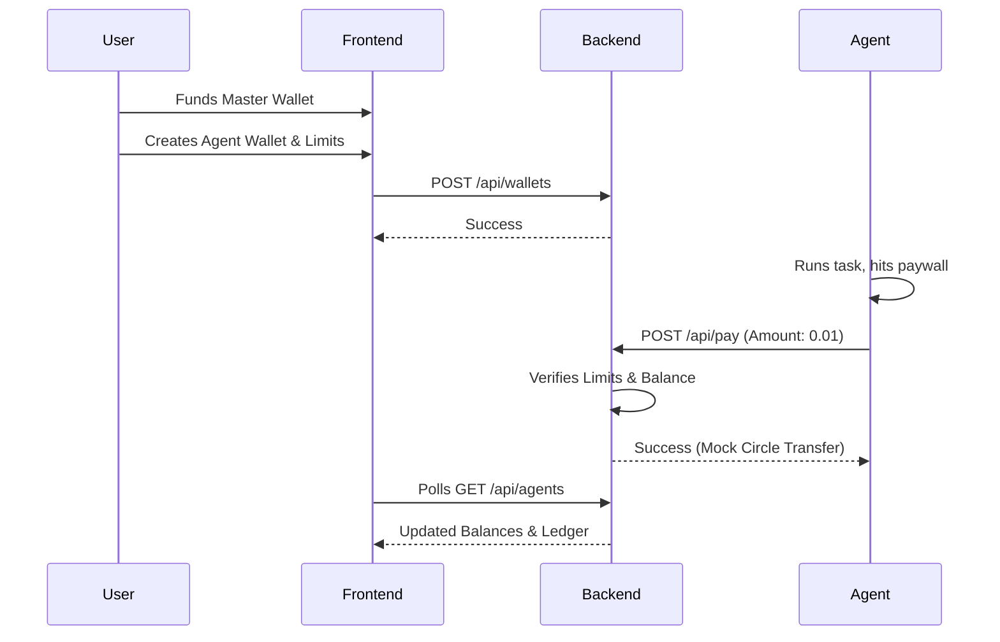

# Agent Fuel – Shared Wallet for AI Agents

Agent Fuel is a decentralized shared wallet infrastructure that empowers AI agents to autonomously manage, spend, and receive funds, bridging the gap between artificial intelligence and the Web3 financial ecosystem.

##  Hackathon Quick Start

### 1. Install Dependencies
Run the following command from the root directory to install dependencies for both the frontend and backend:
```bash
npm run install:all
```

### 2. Start the Application
Launch both the React frontend and Node.js backend simultaneously:
```bash
npm start
```
- **Frontend Dashboard:** [http://localhost:5173](http://localhost:5173)
- **Backend API:** [http://localhost:3001](http://localhost:3001)

### 3. Run the Demo AI Agent
Open a new terminal window, ensure you have Python installed, and run the mock agent to simulate an autonomous micropayment:
```bash
cd agent
pip install -r requirements.txt
python agent.py --agent_id=agent-1 --iterations 50 --fast
```

---

##  Architecture



## 🌐 Deployment (Future)
- **Frontend:** Can be easily deployed to [Vercel](https://vercel.com/new) or [Netlify](https://www.netlify.com/).
- **Backend:** Can be hosted on Render or Heroku.
